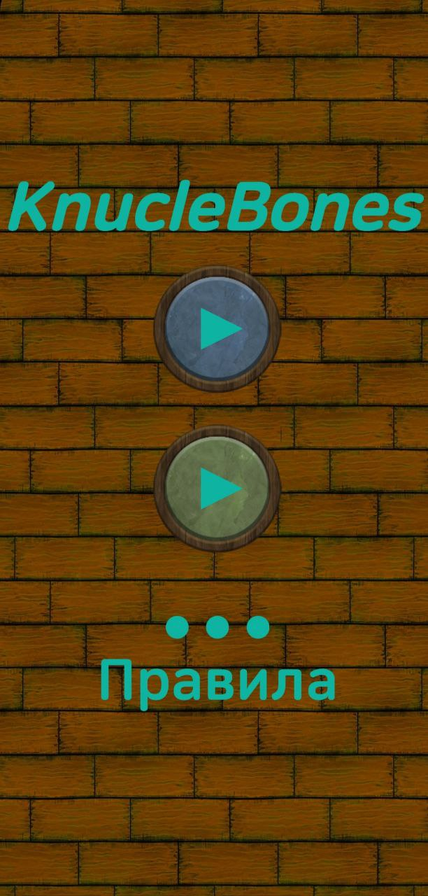
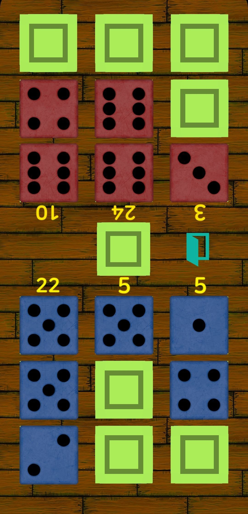

# 📱 Game-KnuckleBones v0.3.8

Мобильная реализация мини-игры *KnuckleBones*, вдохновлённой *Cult of the Lamb*.  
Это пошаговая настольная стратегия для одного или двух игроков, сочетающая простые правила с глубокой тактической составляющей.

---

## 🎮 Особенности

- Простой, но затягивающий геймплей
- Разработка на **Unity** с использованием **C#**

---

## ⚙️ Планы на будущее

- 🌐 Онлайн мультиплеер

---

## 📜 Правила игры

- Играют **2 игрока** или **игрок против ИИ**.
- Игровое поле состоит из **трёх колонок** для каждого игрока.
- В начале хода игрок бросает **кубик (от 1 до 6)** и помещает его в любую свою колонку.
- Если в этой колонке у соперника уже есть кубики с тем же значением — **они уничтожаются**.
- Количество очков в колонке рассчитывается как:  
  **значение кубика × количество таких же кубиков**.
- Побеждает игрок, набравший **больше очков** после заполнения всех колонок.

---

## 📸 Скриншоты

|  |  |
|:-----------------------------------------------:|:----------------------------------------------:|
|                  Начальный экран                |                 Игровой процесс                |

---

## 👤 Обо мне

Привет! Меня зовут Максим — я изучаю C# и разработку игр на Unity.  
Этот проект — моя практика и вдохновение от любимой игры *Cult of the Lamb*.  

📩 Связаться со мной: **popik.maxim@gmail.com**  
🌐 [Мои проекты на GitHub](https://github.com/TRONMAXS)
